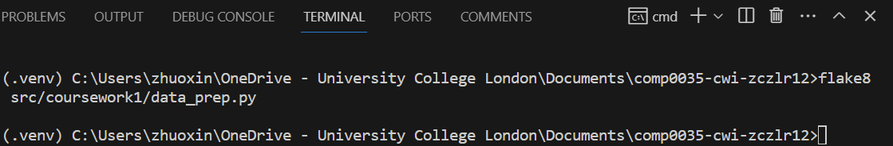

Author of the raw dataset: Paolo Mancuso, Veronica Piccialli, Antonio M. Sudoso (University of Rome Tor Vergata)

# 1. Data preparation and understanding

## 1.4 Explanation of code preparation & understanding

The original dataset of pasta sales data has three kinds of data: Date, the quantity sold for each brand and item, and the associated promotion flag for each item. As my web app needs to predict the future demand of different items and how the sales trend can be affected by the presence of promotions, all columns are necessary. Therefore, there is no need to remove any columns after loading the file `dataset.csv` into a pandas dataframe.

Since the original data file only contains a single dataset with the enough variety of variables (columns) to be directly used in the app, there is also no need to add new columns.

Before printing basic data information and statistics, I used `pandas.set_option` to set the option to display all rows, but I did not use it to set to display all columns because there are hundreds of columns and many of them are of similar kinds, otherwise it will take up a lot of space when `print(df.head())` is used.

The first function defined in the code, `print_df_information()`, is used to print the general information of the dataframe, including number of rows and columns, first 5 rows, column labels, and data types. The output of this function shows that the quantity sold for brand 'X' item 'Y' is represented by the column label `QTY_B'X'_'Y'` and the promotion flag for that item is represented by `PROMO_B'X'_'Y'`. These abbreviations are clear in meaning and make column headings short, so I do not need to rename them. However, the output also indicates that the column labels with the same prefix were placed together, which means the quantity sold and the promotion flag for the same item are many columns apart. This might lead to difficulty in extracting these two columns together for further use. Besides, the data type of column `DATE` is shown as `object` and it should be converted to `datetime` for later use. These two problems are solved in the function `modify_columns()` where I also used `str.strip()` to remove potential blank spaces in column labels.

The two functions `find_nulls()` and `find_duplicates()` print missing values and duplicated rows respectively. The outputs indicate that there are no missing values and no duplicated rows. Hence, it is unnecessary to handle missing values and duplicates.

The function `find_unique_values_of_promotion_flags()`, as the name implies, prints unique values of all columns of promotion flags. The output indicates that the presence and the absence of a promotion are represented by `1`and `0` without any inconsistent values. Unlike many datasets which use non-numeric data such as `Yes` and `No`, the promotion flags are integers which can be directly used in machine learning.

At the end of data preparation, the prepared dataset `prepared_df` returned by `modify_columns()` was saved to `dataset_prepared.csv`.

For data exploration, the first step is to print

# 2. Product and project definition

## 2.2 Product overview

A web app that deploys a machine learning model on a dataset representing the sales of 4 national pasta brands via a REST API to predict future pasta sales.

## 2.3 Persona

# 3. Tools & techniques

## 3.1 Source code control

URL for the repository: https://github.com/ucl-comp0035/comp0035-cwi-zczlr12

## 3.2 Linting

I installed Visual Studio Code extension `flake8` as a linter so that I can see style issues by hovering over the squiggled lines. I also installed `flake8` in the virtual environment using the command `pip install flake8` in the terminal, and check for any unsolved style issues by running the command `flake8 src/coursework1/data_prep.py` before submission.

After correcting the code, the result of running the linter `flake8` (with line wrapping set at 79 characters) becomes blank. This means my final code meets Python standards and is appropriately documented. The evidence is shown as follows:

## 3.4 Use of AI

GitHub Copilot was used to generate some of the code and docstrings after the first few characters had been typed in the data preparation code.