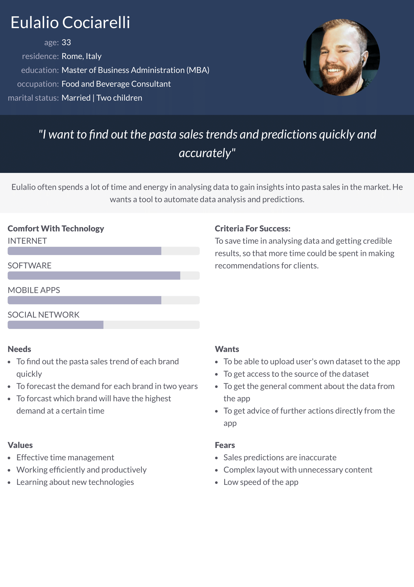

Author of the raw dataset: Paolo Mancuso, Veronica Piccialli, Antonio M. Sudoso (University of Rome Tor Vergata)
# 1. Data preparation and understanding
## 1.4 Explanation of code preparation & understanding
### Preparing the data
# 2. Product and project definition
## 2.1 Problem statement
## 2.2 Product overview
A web app that deploys a machine learning model on a dataset representing the sales of 4 national pasta brands via a REST API to predict future pasta sales.
## 2.3 Persona

## 2.4 Project goal & objectives / Questions
# 3. Tools & techniques
## 3.1 Source code control
## 3.2 Linting
## 3.3 Project planning and tracking
## 3.4 Use of AI
# 4. Methodology
## 4.1 Methodology selection
# 5. References